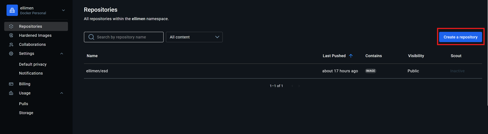
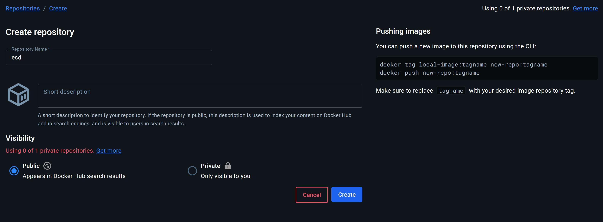
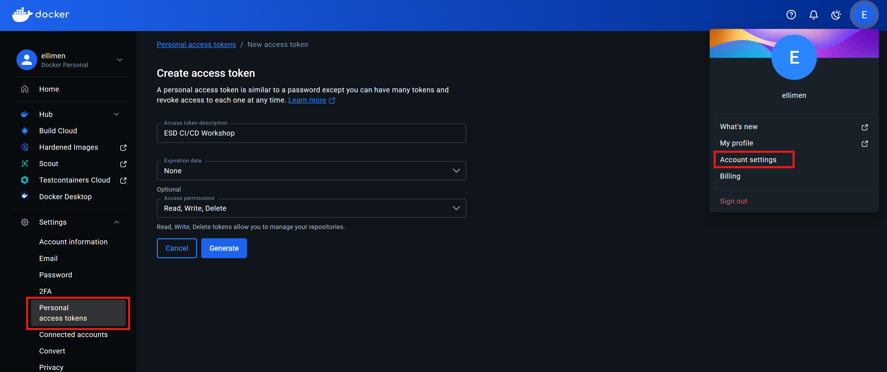
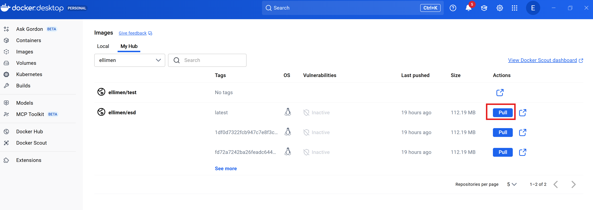
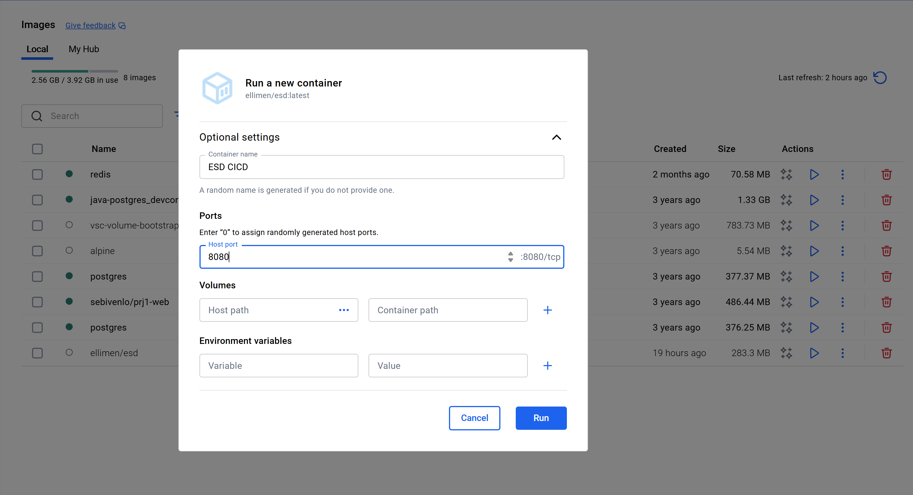

# ESDE_WORKSHOP_TASK_CICD

---

## Prerequisitess

- Docker installed (Desktop or Engine)
- Git + GitHub account
- Create a Docker Hub account and a Personal Access Token (PAT)

## Create Docker Container
After creating an account. Create a repository and name it "esd"

## Create Repository Variable and Secret
GitHub → your fork → Settings → Secrets and variables → Actions

Variables → New repository variable

Name: DOCKERHUB_USERNAME

Value: your actual dockerhub username

Secrets → New repository secret

Name: DOCKERHUB_TOKEN

Value: <your Docker Hub PAT> (created at https://hub.docker.com/settings/security
)
 
Put Read, Write and Delete

## TODOS for the CI file ordered by Number
### TODO1: 
For this we are building a query that will be run in order to create a test coverage report. Test coverage reports are built in the gradlew file. We are using the jacocoTestReport for this specific workshop example.
The query needs to firstly navigate to the gradlew file then run a clean to delete the previous testreport. We then need to run the gradle task associated with creating a test report. These can be found in the build.gradle file. 
Afterwards, add the word "bootJar" at the end. This is used to create a jar file in the build/libs folder containing a snapshot of the project.

### TODO2: 
For the upload of the test reports we use the GitHub action "EnricoMi/publish-unit-test-result-action@v2" by EnricoMi. It is a public GitHub action, which collects test result files like xml files and publishes them to GitHub.

### TODO3-5: 
Now we need to give some conditions of the run the first condition is that the test report should always() be uploaded regardless if previous steps failed or not. 
Secondly, we need to verify that the event that triggered this workflow (pushes, pull requests etc.) was not a pull_request, so that a fork can not receive a test report. This is for protecting secrets. 
This is a OR statement so the other condition focuses on checking if the repository name is exactly the same, or indicates a fork. In order to check this you need to verify that the "github.event.pull_request.head.repo.full_name" matches the "github.repository".

### TODO6 
For this we need to give the file location where to find our generated test reports. These are generated in the "*/build/test-results/test/" location. We additionally need to verify that it only takes xml files into account, so we need to add "*.xml" at the end of that.

### TODO7: 
For the next TODOS we are focusing on the submission of the dependencies of our Gradle project to GitHub. For this action needs to be able to "write" content.

### TODO8: 
For this one similarly to the step before where we need to check that the event is NOT a pull request we now need to verify that it IS a "push".
### TODO9: 
For this we use the "actions/checkout@v4" action. It is a fundamental action used to check our code into the runner to give other jobs access to your repository files.

### TODO10: 
We are using the GitHub action "actions/setup-java@v4" for this as for this step of the job we need to set up our JDK. The setup-java action is an official GitHub action.
### TODO11-12: 
For this we are using the distributor "temurin" and the java version 17. This can also be observed in other steps of our pipeline.

### TODO13: 
For this step we are using the "gradle/actions/dependency-submission@v4". This is a gradle specific GitHub action and is used to help GitHub understand the gradle dependencies of the project.

### TODO14: 
The continue-on-error: step is a boolean which can either be set to "true" or "false". In this case we want the workflow to continue on fail, as the dependency submission is not a necessary step but a useful one to be able to see your dependencies in the GitHub Dependency Graph.
## TODOS for the CD file ordered by number 

### TODO1: 
For this TODO we need the "docker/login-action@v3" action which is used for logging in to Docker.

### TODO2 & TODO3:
For this step we need to prepare our Docker login credentials. 
As you already created them in the GitHub variables / secrets you need to remember the names you gave them. 
Tipp: you need to state if the job can find it in the variables or secrets.

### TODO4 & TODO5:
For building and publishing Docker images we use the official GitHub action docker/build-push-action@v6.
This action replaces running docker build and docker push manually.
It uses Docker Buildx and handles multi-stage and multi-architecture builds internally.
"push:" is a boolean which can either be "true" or "false". Its used to tell the action to upload the built image to Docker Hub once the build is complete, which is what we want in this case.

### TODO6:
For tagging the Docker image we need to provide two different tags:
latest — this will always point to the newest version of the image.
We also need a tag to show the unique commit that triggered this workflow. This can be done using the "github.sha".
### TODO7:
For this step in which we upload to Pages, we need to specify which job this step needs to be able to run. This job needs the job we ran before this, you can find its name above but beneath the "jobs:" line.
### TODO8:
In this step we configure Gradle for the job.
We use gradle/actions/setup-gradle@v4, which is an official Gradle action.
It handles installing and configuring Gradle within GitHub Actions and enables useful features such as caching of Gradle dependencies, which speeds up future builds.
This is necessary because later we will run Gradle commands to build our documentation, run tests, and generate reports.
### TODO9:
For this we are building a query that will be run in order to create a test coverage report. Test coverage reports are built in the gradlew file. We are using the jacocoTestReport for this specific workshop example.
The query needs to firstly navigate to the gradlew file then run a clean to delete the previous testreport. Then we need to test and run the gradle task associated with creating a test report. We create it with jacocoTestReport again. 
Afterwards, add the word "exportPagesData" at the end. This is used to create a jar file in the /docs folder containing the data displayed on GitHub Pages.
### TODO10 & TODO11:
This step works together with the previous step as in this step the actual data file on the /docs folder gets uploaded. For this we use "actions/upload-pages-artifact@v3". The "path:" is as stated before "docs"
### TODO12:
For this step we deploy the previously uploaded documentation using
"actions/deploy-pages@v4".
This is the official GitHub Pages deployment action.
It takes the artifact created earlier and publishes it as a live website under the repository’s GitHub Pages URL.
This is the final step of the documentation deployment process and makes the pages accessible online.
## Run Project locally
Afterwards you can pull your Images here:

And run a container here: 

Afterwards you can check if it worked at: http://localhost:8080/
 
## Repository Badges - Adapt the Link to match YOUR fork to see results

 

 

 
